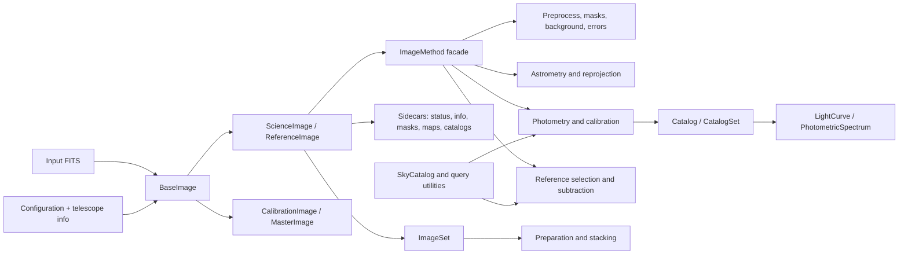

# ezphot codebase guide

This document is a maintainer-oriented map of the repository. It records how the
current code fits together, where state is stored, which workflows are intended,
and which parts need extra caution. It describes the repository at commit
`fd390a2` on 2026-08-05, including uncommitted source changes present during the
review. It is a guide to the current implementation, not a promise that every
path is production-ready.

## What was reviewed

The review covered all first-party Python packages, the dated analysis scripts,
the telescope and external-tool configuration trees, packaged transmission data,
Sphinx source documentation, examples, packaging files, and the small vendored
PanStitch project. Generated HTML under `docs/_build`, bytecode caches, media,
and tabular/binary data were identified and inspected structurally rather than
treated as source code.

The most useful distinction in this repository is:

- `ezphot/{configuration,imageobjects,methods,dataobjects,skycatalog,utils,helper}`
  is the reusable library.
- `ezphot/analysis` is a research workspace of date- and target-specific scripts.
- `ezphot/methods/tract7dt` is an adapter around a separate Tract7DT installation.
- `ezphot/utils/PanStitch-main` is a vendored, mostly independent utility.
- `docs/_build` and `__pycache__` directories are generated artifacts.

## One-page mental model

`ezphot` is an astronomical FITS processing and photometry toolkit. A FITS image
is wrapped in an image object, telescope metadata selects a configuration, and
method objects transform the image or create associated products. Most users
should work through `ScienceImage`, `ReferenceImage`, or `ImageSet`; these expose
the lower-level method classes through convenience methods.



The dominant execution flow is:

1. Construct an image object from a FITS path.
2. Infer observatory, CCD, readout mode, binning, filter, sky position, and other
   metadata from the header.
3. Load common and telescope-specific configuration.
4. Apply calibration, masking, background/error estimation, and astrometry.
5. Extract a catalog and calibrate its photometry against a sky catalog.
6. Optionally prepare and stack many images or subtract a reference image.
7. Save the main FITS product plus JSON-like status/info and FITS/catalog sidecars.

## Repository map

| Path | Responsibility | Main entry points |
| --- | --- | --- |
| `ezphot/__init__.py` | Version and top-level initialization | `ezphot.initialize()` |
| `ezphot/configuration` | Runtime paths, tool templates, telescope registration | `Configuration` |
| `ezphot/imageobjects` | FITS wrappers, sidecars, collections, workflow facade | `ScienceImage`, `ReferenceImage`, `ImageSet` |
| `ezphot/methods` | Image-processing algorithms and external-tool orchestration | `Preprocess`, `Stack`, `Subtract`, photometry classes |
| `ezphot/dataobjects` | Source catalogs and time/spectral products | `Catalog`, `CatalogSet`, `LightCurve`, `Spectrum` |
| `ezphot/skycatalog` | Archived/query reference catalog normalization | `SkyCatalog`, `SkyCatalogUtility` |
| `ezphot/utils` | Data browsing, remote catalog/image query, tiling and sync | `DataBrowser`, `CatalogQuerier`, `ImageQuerier` |
| `ezphot/helper` | FITS/header helpers, math, conversions, external commands | `Helper`, `PhotometryHelper` |
| `ezphot/error` | Custom exceptions | `ExternalToolError`, `PlatesolveError` |
| `ezphot/analysis` | One-off observing and research programs | Run as scripts, not package APIs |
| `docs` | Sphinx API and usage documentation | `docs/index.rst` |
| `examples` | Notebook examples | Interactive use |

The package version is `0.4.16`, requires Python 3.9 or newer, and has no
installed command-line entry point. `setup.py` reads dependencies directly from
`requirements.txt`; `MANIFEST.in` includes configuration and utility resources,
and excludes `ezphot/analysis` and generated documentation.

Root maintenance files need care:

- `scan_dependency.py` is a dependency scanner left over from the former `tippy`
  package name. As written, it scans `tippy/` and overwrites `requirements.txt`,
  so it must be corrected before use.
- `update_pypl.sh` bumps the patch version in place, recursively removes build
  artifacts, builds the package, and uploads to PyPI. It is a release operation,
  not a harmless validation script.
- `.readthedocs.yaml` installs the package and `docs/requirements.txt` on Python
  3.11. `docs/conf.py` still reports release `0.3.0`, so rendered version metadata
  is behind the package version.

## Configuration and runtime state

### First-use behavior

Creating `Configuration()` is not read-only. If the common configuration folder
does not exist, construction calls `initialize()` automatically. By default this
creates and populates:

```text
~/ezphot/
├── config/
│   ├── common/
│   └── specific/<TELKEY>/
├── data/
│   ├── calibdata/
│   ├── mcalibdata/
│   ├── obsdata/
│   ├── refdata/
│   ├── scidata/
│   ├── skycatalog/archive/
│   └── connecteddata/7DT/
└── log/
```

Use a temporary or explicit `configpath` when tests must not touch the user's
home directory:

```python
from ezphot.configuration import Configuration

config = Configuration(configpath="/tmp/my-ezphot/config")
```

`ezphot.initialize(configpath=...)` is a top-level convenience wrapper. The
current Sphinx getting-started page also calls `config.initialize()` explicitly,
but construction already initializes a missing tree.

### Telescope keys

A telescope key is either:

```text
OBSERVATORY_CCD_READOUTMODE_BINxBIN
OBSERVATORY_CCD_BINxBIN
```

The key is matched against `configuration/common/observatory_info.dat` using
observatory, CCD, optional readout mode, and integer binning. Header aliases used
to infer those fields live in `observatory_info_hint.yaml`. Supported packaged
profiles currently cover 7DT/C361K variants, CBNUO, HSC, KCT, LSGT, RASA36, SAO,
and SOAO.

Each profile produces tuned SExtractor, Astrometry.net-extraction, SCAMP, SWarp,
and PSFEx configuration files. Global JSON `.config` files hold the runtime
directory locations; telescope-specific `.config` files override relevant tool
paths.

### Important configuration behavior

- Initialization copies packaged defaults into the runtime configuration tree.
- Registering a telescope regenerates its tool configs from the common templates.
- `_ensure_dirs_exist()` silently ignores directory-creation failures. If a later
  path error is surprising, verify the configured directories first.
- `BaseImage` and most helpers inherit or instantiate `Configuration`, so merely
  constructing normal library objects can trigger initialization.
- Runtime config is distinct from the checked-in templates. Editing a packaged
  template does not update an already initialized `~/ezphot/config` tree until it
  is copied or regenerated.

## Image object model

### Base classes

`BaseImage` is the FITS-aware base for observational images. It lazily loads data
and headers, normalizes header aliases, estimates telescope information, exposes
WCS and image metadata, creates cutouts, displays images, and can launch DS9.
Frequently used properties include `data`, `header`, `wcs`, `center`,
`pixelscale`, `observatory`, `telname`, `ccd`, `imgtype`, `objname`, `filter`,
`obsdate`, `exptime`, `gain`, `egain`, `seeing`, `zp`, and `depth`.

`DummyImage` is a lighter FITS-like base used by derived pixel products. It keeps
lazy data/header loading and common visualization/WCS behavior without all of the
observational metadata logic.

### Primary images

`ScienceImage(BaseImage, ImageMethod)` is the central workflow object. It stores
processing status and metadata, determines an organized save directory, discovers
its sidecars lazily, and exposes high-level processing methods.

`ReferenceImage` is nearly parallel to `ScienceImage`, with conversion back to a
science image and `register()`/`deregister()` support for the reference summary
table under `REFDATA_DIR`.

`CalibrationImage` represents bias, dark, and flat exposures. `MasterImage`
represents combined calibration products and maintains a summary table under
`CALIBDATA_MASTERDIR`.

Default save layouts are:

```text
SCIDATA_DIR/<observatory>/<telkey>/<object>/<telescope>/<filter>/
REFDATA_DIR/<observatory>/<telkey>/<object>/<telescope>/<filter>/
CALIBDATA_DIR/<observatory>/<telkey>/<image-type>/<telescope>/
CALIBDATA_MASTERDIR/<observatory>/<telkey>/<image-type>/<telescope>/
```

When required metadata is missing, image classes fall back to the input file's
parent directory. A manually assigned `savedir` overrides the organized layout.

### Status, info, and filenames

Primary image status is a fixed set of timestamped flags:

```text
BIASCOR  DARKCOR  FLATCOR  ASTROMETRY  SCAMP  ASTROALIGN  REPROJECT
BKGSUB   ZPCALC   STACK    ZPSCALE     SUBTRACT  PHOTOMETRY  MASTER
```

The main FITS file is accompanied by `<filename>.status` and `<filename>.info`.
The classes contain separate, substantially duplicated `Status` and `Info`
implementations; they are not one shared type.

For a science/reference file named `image.fits`, the save-path namespace defines:

| Product | Naming convention |
| --- | --- |
| Generic/invalid/source/cosmic/bad-pixel/subtraction masks | `.mask`, `.invalidmask`, `.srcmask`, `.crmask`, `.bpmask`, `.submask` |
| Background and noise | `.bkgmap`, `.bkgrms`, `.srcrms` |
| Weights | `.bkgweight`, `.srcweight` |
| Catalogs | `.cat`, `.psfcat`, `.refcat`, `.stampcat` |
| Aligned/combined/coadded | `align_`, `com_`, `coadd_` prefixes |
| Scaled/convolved/subtracted/inverted | `scale_`, `conv_`, `sub_`, `inv_` prefixes |

`Mask`, `Background`, and `Errormap` derive from `DummyImage`. Their status is an
event dictionary rather than the fixed primary-image steps, and each records a
link back to its target image. `Mask.combine_mask()` supports boolean combination.
`Errormap.to_weight()` converts RMS to inverse variance; `to_rms()` performs the
inverse square-root conversion.

### ImageMethod facade

`ImageMethod` avoids forcing users to instantiate every algorithm class. It
creates and delegates to the method objects behind calls such as:

- calibration: `correct_bias`, `correct_dark`, `correct_flat`, `correct_bdf`;
- masks/background/errors: `calculate_invalidmask`, `calculate_sourcemask`,
  `calculate_bkg`, `calculate_bkgrms`;
- astrometry: `platesolve`, `reproject`;
- photometry: `photometry_sex`, forced circular/elliptical photometry,
  `photometric_calibration`, and zero/color/magnitude-term application;
- references and difference imaging: `get_referenceframe`,
  `query_referenceframe`, and `DIA`.

The direct method classes remain useful when an operation is not exposed by the
facade or when processing many heterogeneous inputs.

### ImageSet

`ImageSet` wraps a list of images and maintains original IDs plus a selected
subset. It can build a metadata table in parallel, select/exclude/divide images,
load sidecars, select quality frames, prepare a stack, and stack it. `df` describes
all images and `target_df`/`target_images` describe the current selection.

Because multiprocessing workers reconstruct or inspect image objects, code using
`ImageSet`, `Stack`, or multiprocessing query helpers should be called behind an
`if __name__ == "__main__":` guard on spawn-based platforms.

## Processing methods

### Calibration: `methods/preprocess.py`

`Preprocess` locates master frames, creates master bias/dark/flat products, and
applies bias, dark, flat, bias+dark, or full BDF correction. The implementations
use `ccdproc`, propagate relevant headers and status, and return new image objects.
Master discovery depends on the configured directory hierarchy and image metadata.

### Masks: `methods/maskgenerator.py`

`MaskGenerator` provides:

- invalid-pixel masking for NaNs and large connected zero regions;
- source masks built from photutils segmentation;
- circular masks in pixel or sky coordinates;
- cosmic-ray masks through `astroscrappy`.

### Background and uncertainty

`BackgroundGenerator` estimates 2-D background and RMS with SEP, retains an older
photutils estimator, and subtracts background maps. `ErrormapGenerator` can build
background/source RMS maps either from the observed image/SEP statistics or by
propagating calibration-frame noise. A source RMS includes source shot noise;
background RMS does not. `Errormap` can be converted to a weight map for tools
that require inverse variance.

### Astrometry and reprojection

`Platesolve` wraps Astrometry.net `solve-field` for an initial WCS and SCAMP for
catalog-based refinement. SCAMP application removes stale SIP keywords before
installing the new TPV-style solution.

`Reproject.align()` uses astroalign. `Reproject.reproject()` uses SWarp, can carry
an error/weight map, and produces invalid-pixel masks for uncovered areas.

### Aperture and PSF photometry

`AperturePhotometry` supports SExtractor detection/photometry, photutils-based
photometry, and forced circular or elliptical apertures in pixel or sky
coordinates. Inputs may include a background, RMS map, and mask. Outputs are
`Catalog` objects.

`PSFPhotometry` extracts sources, chooses isolated PSF stars, builds either an
internal photutils ePSF or a PSFEx model, fits sources, applies aperture
corrections, and can emit model/residual images. The internal ePSF path is marked
as obsolete in code; the PSFEx path is the intended external-tool route.

### Photometric calibration

`PhotometricCalibration.photometric_calibration()` obtains an archived or queried
reference catalog, sky-matches it to detections, selects suitable stars, computes
zero points per magnitude measurement, and estimates seeing, sky level,
ellipticity, and limiting depths. It updates the FITS header and adds calibrated
catalog columns. Separate methods fit or apply zero point, color, and magnitude
terms.

Reference-source selection uses magnitude, S/N, morphology, FWHM, flags, spatial
region, and isolation constraints. Dynamic magnitude-range selection tries to
find a stable unsaturated calibration interval.

### Stack

`Stack.prepare_images()` can perform, in order, background subtraction, zero-point
scaling, seeing convolution, and reprojection. `stack_multiprocess()` combines
image patches with shared memory and supports mean, median, sum, and weighted
combinations plus optional clipping. It returns a stacked image and, when supplied,
a combined background RMS map. `select_quality_images()` filters on seeing, depth,
and ellipticity.

`stack_swarp()` remains in the source and documentation but is currently labeled
obsolete in the usage guide and has internal API drift; see the risk section.

### Difference imaging: `methods/subtract.py`

`Subtract` obtains or accepts a reference, aligns/reprojects images, trims to their
overlap, calls HOTPANTS, performs subtraction-image aperture photometry, filters
candidates, and creates inspection plots. It also contains reference lookup,
remote query, and reference-quality selection logic. The high-level entry is
`ScienceImage.DIA()`.

## Catalogs and science products

### Catalog and CatalogSet

`Catalog` is a lazy Astropy `Table` wrapper associated with an image through its
info sidecar. Supported semantic types include all, reference, valid, transient,
candidate, forced, PSF, and stamp catalogs. It can select sources, apply masks or
zero points, write/remove itself, display sources, and create DS9 regions or
postage-stamp products.

`CatalogSet` wraps multiple catalogs, mirrors the select/exclude/divide pattern of
`ImageSet`, selects sources across epochs, and merges catalogs by sky coordinate
while suffixing measurement columns by catalog index and retaining per-catalog
metadata.

### LightCurve and PhotometricSpectrum

`LightCurve` finds a source near a requested sky coordinate in a `CatalogSet`,
assembles its measurements across exposures, and plots detections and limits over
time with filter-specific styling.

`PhotometricSpectrum` follows the same idea across filters/wavelengths to build
and plot a photometric spectral energy distribution.

### Spectrum

`SpectrumFile` reads ASCII or FITS spectra and heuristically identifies wavelength,
flux, and error columns/units. `Spectrum` wraps a `specutils.Spectrum1D`, exposes
f-lambda, f-nu, Jy, mJy, and AB-magnitude conversions, plots spectra, and performs
synthetic photometry using `pyphot` and the packaged transmission curves.

## Sky catalogs and remote data

`CatalogQuerier` is a Vizier/Skybot frontend. Its configured choices include Gaia,
Gaia XP, 2MASS, AllWISE, Pan-STARRS1, SDSS, and Solar System objects via Skybot.

`SkyCatalog` presents normalized reference sources from archive or query paths for
APASS, Gaia/GaiaXP, Pan-STARRS1, SDSS, SkyMapper, and corrected GaiaXP products.
`SkyCatalogUtility` locates archived catalog tiles overlapping an image, combines
them, and applies reference-star filters.

`ImageQuerier` uses MOC coverage checks and HiPS2FITS image queries for configured
surveys including SkyMapper, Pan-STARRS1, SDSS, DESI, DSS, ZTF, DECaLS, and DES.
Large requested images are divided into tiles and then recombined as a
`ReferenceImage`. `imagequerier_standalone.py` is an older duplicate implementation.

`Tiles` reads the packaged 7DT tile geometry and finds point or aperture overlaps.
It uses Astropy coordinates plus Shapely planar polygons and can visualize the
matching tiles. `SDTDataQuerier` discovers `7DT??` directories and invokes `rsync`
to synchronize observational or processed data. `SkyMapperStitch` is a legacy
SkyMapper download/mask/stitch workflow.

Smaller utility modules are less integrated with the public API:

- `ImageFormatter` subclasses `DataBrowser` to search FITS files and check or
  rewrite required header fields.
- `FilterRegister` in `update_new_transmission.py` reads, normalizes, plots, and
  describes local/pyphot filter curves.
- `timeout.py` provides a Unix `SIGALRM` decorator.
- `update_refinfo.py` is empty in this snapshot.
- PanStitch contains a Pan-STARRS1 downloader and a minimal SWarp list/stitch
  wrapper; its test directory is a usage sample rather than ezphot coverage.

`skycatalog/conversion.py` collects empirical color transformations among APASS,
Pan-STARRS1, SDSS, SkyMapper, and JH-style systems. Treat these as domain formulas
that need validation for a particular calibration range, not general-purpose
unit conversions.

## Helpers and external programs

`Helper` combines `PhotometryHelper` and `AnalysisHelper`. Despite the exports in
`helper/__init__.py`, it does not inherit `Queryhelper` or `SpectroscopyHelper`.

`PhotometryHelper` is the broad infrastructure layer: FITS/header normalization,
telescope inference, time/coordinate conversion, table matching/grouping,
convolution/alignment, memory reporting, DS9 regions, and wrappers for external
commands. `run_command()` centralizes subprocess execution, timeout handling, and
error reporting.

`AnalysisHelper` contains file-format adapters, HESMA/Polin readers, physical and
photometric conversions, interpolation, and a Planck function. `OperationHelper`
contains small numba-compiled array operations. `SpectroscopyHelper` and
`Queryhelper` are separate specialized helpers.

The following executables or external environments are expected by some paths and
are not supplied by `pip install ezphot`:

| Capability | External dependency |
| --- | --- |
| Initial WCS | Astrometry.net `solve-field` |
| Detection/catalog extraction | SExtractor / Source Extractor |
| Astrometric refinement | SCAMP |
| Resampling/coaddition | SWarp |
| PSF model generation | PSFEx |
| Difference imaging | HOTPANTS |
| Interactive FITS display | SAOImage DS9 |
| 7DT data transfer | `rsync` |
| Tractor multiband fitting | Conda plus separately installed `tract7dt` CLI |

Remote paths also require network access to services used by Astroquery, Vizier,
Skybot, HiPS2FITS/MOC, and survey-specific APIs.

## Tract7DT adapter

`methods/tract7dt/configuration.py` models the external pipeline's YAML using
dataclasses for input/output paths, scaling, crop/overlay checks, saturation and
bright masks, logging, ePSF construction, patching, fitting, Moffat behavior,
merge behavior, and zero-point handling.

`Formatter` writes an image list and creates the multiband target input CSV by
matching supplied target coordinates to per-filter catalogs. `Tract7DTRunner`
creates `~/tract7dt/<id>` by default, registers targets and a reference catalog,
writes YAML, invokes `conda run -n <env> tract7dt run --config ...`, and converts
the final output into an ezphot `.tract7dtcat`. `wrapper.py` is an older alternate
launcher.

The directory also contains sample/run artifacts (`sample.yaml`, input lists,
catalogs, and images). These are examples, not library resources required by the
runner.

## Analysis workspace

The 55 Python files in `ezphot/analysis` are notebook-style or executable research
scripts, commonly divided with `#%%` cells. They are excluded from distribution
by `MANIFEST.in`, are not imported by the package, and frequently contain absolute
paths, target names, observation dates, and machine-specific assumptions.

The main families are:

- preprocessing, stacking, and photometry for named 7DT/LOAO/HSC targets;
- difference-imaging studies for S250206dm, S250725j, S250830bp, SN2021aefx,
  SN2025fvw, S251112cm, T01318, T02385, T06911, and T08803;
- GaiaXP/CALSPEC synthetic-photometry, shifted-catalog, and filter-zero-point
  experiments;
- Tract7DT version/test programs;
- catalog aggregation, variability/depth/seeing checks, target selection,
  visualizations, PNG/video generation, and calibration-frame diagnostics.

Use these scripts as provenance and worked examples. Before reusing one, replace
absolute paths, inspect its current cell ordering, and run a syntax check. Several
files deliberately contain pasted tables or incomplete interactive cells and are
not valid standalone Python in the current snapshot.

## Practical starting points

### Load and inspect an image

```python
from ezphot.imageobjects import ScienceImage

image = ScienceImage("/data/example.fits")
print(image.info)
print(image.status)
print(image.wcs)
image.show()
```

Construction infers telescope configuration from the FITS header. If inference
is ambiguous, pass a compatible `telinfo` row or fix/register the header mapping.

### Discover organized data

```python
from ezphot.utils import DataBrowser

browser = DataBrowser("scidata")
browser.objname = "T00528"
browser.filter = "r"
images = browser.search("*.fits", return_type="science")
```

For `return_type="path"`, the result is grouped by telescope. Object return types
produce an `ImageSet`; catalog queries produce a `CatalogSet`; `imginfo` produces
an Astropy table.

### Typical single-image preparation

```python
from ezphot.imageobjects import ScienceImage

image = ScienceImage("/data/example.fits")
image = image.correct_bdf(save=True)
image = image.platesolve(save=True)
invalid = image.calculate_invalidmask(save=True)
sources = image.calculate_sourcemask(save=True)
background = image.calculate_bkg(
    target_ivpmask=invalid,
    target_srcmask=sources,
    save=True,
)
bkgrms = image.calculate_bkgrms(
    target_ivpmask=invalid,
    target_srcmask=sources,
    save=True,
)
catalog = image.photometry_sex(
    target_bkg=background,
    target_bkgrms=bkgrms,
    target_mask=invalid,
    save=True,
)
```

Signatures have evolved faster than the examples in places. Confirm a method's
current signature with `help(image.method_name)` or the source before launching a
large batch.

### Work with a set

```python
from ezphot.imageobjects import ImageSet

image_set = ImageSet(list_of_science_images)
print(image_set.df)
selected = image_set.select_images("FILTER", ["r"])
stacked, stacked_rms = selected.stack(n_proc=4)
```

Selection methods update or return the active subset according to their current
implementation; inspect `target_images` before a destructive or expensive step.

## Current risks and maintenance notes

These observations describe the reviewed snapshot and were not repaired as part
of writing this guide.

### Security

- `helper/queryhelper.py` contains default third-party account credentials and an
  API token in source. Remove them, rotate the exposed secrets, and load credentials
  from environment variables or a secret store before using or publishing that
  integration.

### Known broken or stale paths

- `Stack.stack_swarp()` calls `prepare_images()` with keyword names that the
  current `prepare_images()` signature does not accept. `ImageQuerier.query()`
  also passes `pixel_scale` to `stack_swarp()`, whose explicit signature does not
  define it. The SWarp stacking/query-reassembly path therefore needs API repair
  and tests before use.
- `ErrormapGenerator.calculate_sourcerms_from_propagation()` contains a malformed
  numexpr expression around the flat-field term (`/fcf mflat_map`). That path is
  expected to fail when evaluated.
- `PSFPhotometry.build_epsf_model_psfex()` writes mask options into an undefined
  `sex_params` variable instead of the local PSFEx SExtractor parameter mapping.
  The failure is reached when a target mask is supplied.
- `Errormap.target_img` imports `ScienceImage` from `tippy.imageobjects` instead of
  `ezphot.imageobjects`.
- `skycatalog/conversion.py` defines `PANSTARRS1_to_SDSS` twice; the second
  definition silently replaces the first.
- `imageobjects/imageset copy.py` and `utils/imagequerier_standalone.py` are stale
  duplicate implementations and can diverge from their active counterparts.
- Documentation calls the SWarp stacking route obsolete, while code still calls
  it from remote reference-image assembly.
- `ImageFormatter.search_files()` passes a `folder` keyword to `DataBrowser.search()`,
  but that method currently has no `folder` parameter.
- `update_new_transmission.py` runs example statements at import time, including
  constructing `FilterRegister`; do not import it as a passive utility until the
  example is protected by a main guard.

### Mutation and deletion hazards

- `PhotometryHelper.run_swarp(fill_zero_tonan=True)` opens every input FITS in
  update mode and changes zero-valued pixels to NaN before running SWarp. Set the
  option deliberately and never assume SWarp wrappers are input-preserving.
- `BaseImage.rename()` unlinks an existing destination before renaming.
- `write()` methods generally use FITS overwrite behavior.
- `remove()` methods can delete the main object and connected sidecars. Inspect
  `connected_files` and the resolved save path first.
- Several stacking/preparation paths optionally clear or remove intermediates.
- Reference and master registration update shared summary files. Portalocker is a
  dependency, but review the exact registration path before concurrent writers.

### Robustness and maintainability

- Broad `except:`/`except Exception: pass` blocks occur throughout query,
  configuration, metadata, and processing code and can turn real failures into
  missing products or `None` values.
- Status/info/save-path logic is duplicated across image classes, increasing the
  chance of behavioral drift.
- There are mutable list/dict defaults in public APIs. Avoid mutating caller or
  default objects, and prefer fresh values when extending the code.
- Eager package exports plus local imports are used to manage circular dependency
  pressure among image and method classes. When adding imports, test a clean
  interpreter import rather than only a warmed notebook.
- `DataBrowser("mcalibdata")` and `MasterImage.savedir` should be compared before
  relying on discovery: their hierarchy construction has differed in code.
- Domain calculations mix pixels, arcseconds, degrees, ADU, electrons, and several
  flux conventions. Preserve units explicitly when changing an algorithm.

### Syntax and test state

There is no dedicated first-party unit-test suite or CI configuration in the
repository. The notebooks, Sphinx examples, PanStitch sample, and files with
`test` in `ezphot/analysis` are examples/experiments rather than regression tests.

A read-only AST parse of 128 Python files found nine invalid analysis scripts in
the reviewed working tree:

```text
ezphot/analysis/250911_S250830bp_DIA.py
ezphot/analysis/251120_test_T00290.py
ezphot/analysis/260204_GaiaXP_corr_compare_with_calspec.py
ezphot/analysis/260209_compare_gaiaXP_and_gaiaXP_cor.py
ezphot/analysis/260615_calspec_process.py
ezphot/analysis/260618_calspec_process.py
ezphot/analysis/260630_new_filter_zp.py
ezphot/analysis/260720_process_dhkim.py
ezphot/analysis/260723_proces_images_for_Young.py
```

The reusable package files parsed successfully in that scan. It does not prove
imports or runtime workflows succeed, because imports may initialize user state
and many functions require external binaries, catalogs, network services, and
real astronomical data.

## Where to make a change

| Desired change | Start here | Also check |
| --- | --- | --- |
| Support a new FITS header spelling | `helper/photometryhelper.py` | `observatory_info_hint.yaml`, `BaseImage` |
| Add a telescope/camera | `configuration/common/observatory_info.dat` | `Configuration.register_telescope()`, specific templates |
| Change output organization | Relevant image object's `savedir`/`savepath` | `DataBrowser.searchpath`, summary registration |
| Add a processing step | `methods/<operation>.py` | `ImageMethod`, `Status.PROCESS_STEPS`, docs |
| Add a sidecar type | Primary image `savepath` and lazy property | sidecar class, copy/remove/connected-files logic |
| Change aperture catalog columns | `methods/aperturephotometry.py` | `Catalog`, calibration, analysis scripts |
| Change photometric calibration | `methods/photometriccalibration.py` | `SkyCatalog`, color conversions, header keys |
| Change stack preparation | `methods/stack.py` | `ImageSet`, `ImageQuerier`, error-map propagation |
| Change subtraction candidates | `methods/subtract.py` | `Catalog` types, masks, visualization |
| Add a survey catalog | `utils/catalogquerier.py` or `imagequerier.py` | `SkyCatalog`, normalization and coverage |
| Add a filter curve | `configuration/common/transmission` | `FilterRegister`, `Spectrum.synphot()` |
| Change Tract7DT YAML | `methods/tract7dt/configuration.py` | `Formatter`, runner, external version |

## Suggested verification strategy

Because the repository lacks regression tests, add narrow tests around the layer
being changed and isolate user state:

1. Parse all Python source with `ast.parse` without generating bytecode.
2. Initialize configuration under a temporary directory and assert generated
   common/specific paths.
3. Build minimal synthetic FITS headers for each supported telescope-key shape.
4. Exercise pure-Python masks, background, catalog, and conversion functions with
   small arrays/tables.
5. Mock external commands at `PhotometryHelper.run_command()` for wrapper tests.
6. Run opt-in integration tests only when the relevant binary and real reference
   data are available.
7. For end-to-end changes, verify the FITS output, status flag, info JSON, header
   provenance, sidecar paths, and cleanup behavior—not only the return object.

## Recommended reading order

For a new maintainer, this sequence gives the fastest accurate model:

1. `README.md`, `ezphot/__init__.py`, and `configuration/configuration.py`.
2. `imageobjects/baseimage.py`, then `scienceimage.py` and `imagemethod.py`.
3. The method module for the workflow being changed.
4. `helper/photometryhelper.py`, especially metadata normalization and external
   command wrappers.
5. `dataobjects/catalog.py` and `skycatalog/skycatalog.py` for photometric work.
6. `imageobjects/imageset.py` and `methods/stack.py` for batch work.
7. `methods/subtract.py` for difference imaging.
8. Relevant Sphinx usage pages and dated analysis scripts as examples, checking
   them against current signatures rather than treating them as authoritative.
